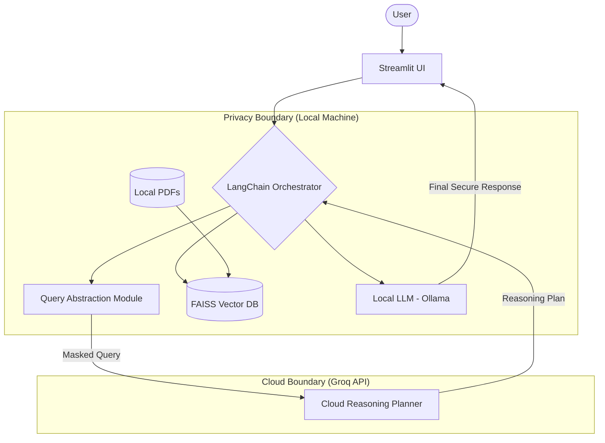

# System Architecture Documentation

## 🏗️ Architecture Overview

The system follows a **Separation of Concerns** principle applied to privacy-preserving AI.

### Component Interaction

1.  **Query Abstraction**: Removes PII (Emails, Names, IDs) using regex-based filters. It then transforms the specific request into a generic reasoning task.
2.  **Cloud Reasoning Planning**: The High-Reasoning Cloud LLM (Llama 3 70B) receives the *logic* of the task but none of the *data*. It outputs a step-by-step plan (e.g., "1. Check date of birth, 2. Look for hypertension history, 3. Calculate risk score...").
3.  **Local Execution (RAG)**: The Local LLM (Mistral) retrieves the *actual data* from the local FAISS index and follows the *instructions* from the cloud plan to produce the final answer.

## 🔌 API Summary

| Endpoints (Internal) | Description |
| --- | --- |
| `VectorStoreManager.process_pdf()` | Ingests PDFs into local storage. |
| `QueryAbstrator.abstract_query()` | Masks PII and returns generic prompt. |
| `CloudPlanner.generate_plan()` | Calls Groq for structured reasoning steps. |
| `LocalExecutor.execute_plan()` | Calls Ollama with local context and cloud plan. |

## 🔑 Credential Locations
- Environment variables in `.env`: `GROQ_API_KEY`.
- Ollama automatically manages local model authentication if applicable (default is open local).
